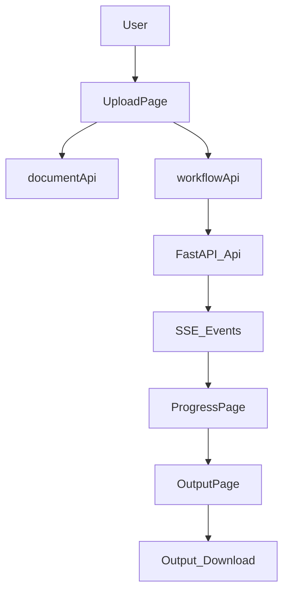

# AI SDLC — Frontend

React + TypeScript + Vite + Tailwind UI for the document workflow. The frontend talks to FastAPI using `/api` endpoints and consumes progress via SSE (`/workflow-runs/{id}/events`).

## Stack

- React 18 + React Router
- Vite 5 + TypeScript
- Tailwind CSS
- Zustand (global workflow state)
- Axios (shared API client + envelope unwrapping)
- EventSource for workflow progress streaming
- react-markdown + remark-gfm
- docx-preview
- lucide-react

## Quick Start

```bash
cd frontend
npm install
npm run dev
```

Dev URL: `http://localhost:3000`

## Architecture Overview

### Route map

- `/` -> upload flow (`UploadPage`)
- `/progress` -> live multi-workflow progress (`ProgressPage`)
- `/output` -> final section review and download (`OutputPage`)
- `/templates` -> template management (`TemplatesPage`)
- `/templates/:templateId/preview` -> template preview details (`TemplatePreviewPage`)

### Core frontend modules

- `src/App.tsx` - top-level router + lazy page loading.
- `src/store/useJobStore.ts` - shared state for selected doc types, template IDs, workflow IDs, and status snapshots.
- `src/api/client.ts` - shared Axios instance; unwraps backend success envelope.
- `src/api/workflowApi.ts` - create workflow, poll status, subscribe to SSE events.
- `src/pages/UploadPage.tsx` - upload + validation + workflow creation.
- `src/pages/ProgressPage.tsx` - SSE-first orchestration with polling fallback.
- `src/pages/OutputPage.tsx` - assembled content display and download actions.

### Runtime flow



## Data Flow (End to End)

1. User uploads BRD file and selects output types + template per type on `/`.
2. Frontend uploads document (`POST /documents/upload`), then creates one workflow per selected type (`POST /workflow-runs`).
3. Workflow run IDs are stored in Zustand (`workflowRunByType`).
4. `/progress` opens one SSE stream per workflow run and updates per-type progress.
5. If SSE becomes unreliable or closed, polling (`GET /workflow-runs/{id}/status`) continues progress tracking.
6. On completion, frontend fetches full workflow details and assembles section navigation for `/output`.
7. User downloads generated files through output endpoints.

## API Contract Notes

- Backend success envelope is normalized by `src/api/client.ts`.
- Most API callers consume plain `data` payloads after interceptor unwrapping.
- Errors preserve backend shape and are surfaced with `getApiErrorMessage`.

## Environment and Configuration

- `VITE_API_BASE` (default `/api`)
  - Dev default assumes Vite proxy to backend.
  - For cross-origin deployments, set full API base (for example `https://your-api.example.com/api`).

Backend proxy target in development is configured in Vite and usually points to `http://127.0.0.1:8000`.

## Debugging Guide

### Backend not reachable

- Verify backend is running and healthy (`GET /api/health`).
- Confirm frontend `VITE_API_BASE` and dev proxy target match backend origin.

### Progress stuck on `/progress`

- Check browser devtools for SSE connection errors on `/workflow-runs/{id}/events`.
- Verify workflow IDs exist in `useJobStore` and backend status endpoint returns progress.
- Confirm fallback polling requests are succeeding.

### Download issues on `/output`

- Confirm `output_id` exists in workflow details.
- Verify `GET /api/outputs/{output_id}/download` returns file response.

## Test Commands

```bash
npm test
```

Optional production check:

```bash
npm run build
```

## Related Docs

- Root setup and environment: [`../README.md`](../README.md)
- System overview and pipeline: [`../docs/ARCHITECTURE.md`](../docs/ARCHITECTURE.md), [`../docs/PIPELINE.md`](../docs/PIPELINE.md)
- API contract: [`../docs/API.md`](../docs/API.md)
